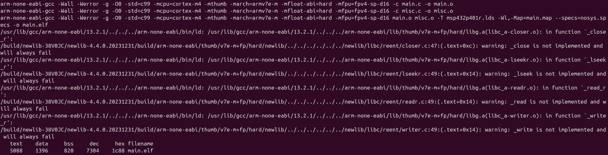

# Memory Segments Control & Analysis: DEVJOURNAL

> This project was developed as part of the **Introduction to Embedded Systems Software & Development Environments** course (Module 3) by the University of Colorado Boulder.
> 
> **Date:** June 6, 2025  
> **Author:** Timofei Alekseenko  

---

## Step 1 — Initial Setup & Makefile Creation

### 1. Given

- **A [folder](https://github.com/afosdick/ese-coursera-course1/tree/master/assessments/m3) containing**:
  - `main.c`
  - `misc.c`
  - `misc.h`
  - `msp432p401r.lds`

- **Requirements & Instructions**:
  1. Analyze how code/data symbols are placed in memory.
  2. Generate a `.map` file.
  3. Use `nm`, `objdump`, etc., to inspect symbol addresses, sections, lifetimes, access.
  4. Ultimately, analyze for each symbol:
     - Top segment (Code/Data/Peripheral/Register/None)
     - Sub-segment (Stack/Heap/BSS/Data/const/rodata/None)
     - Access permissions (R/W/RW/None)
     - Lifetime (Function/Block/Program/Indefinite/None)

### 2. Objective of Step 1

- **Create a working Makefile** that:
  - Compiles `main.c` & `misc.c` for MSP432 (Cortex-M4F).
  - Links with the `.lds` script to produce `main.elf` & `main.map`.
  - Uses `--specs=nosys.specs` to stub out Newlib syscalls.
  - Provides a minimal “all” and “clean” target.

### 3. The Makefile

```makefile
# Source files
SOURCES := main.c misc.c

# Compiler & flags
CC      := arm-none-eabi-gcc
CFLAGS  := -Wall -Werror -g -O0 -std=c99 \
           -mcpu=cortex-m4 -mthumb -march=armv7e-m \
           -mfloat-abi=hard -mfpu=fpv4-sp-d16
LDFLAGS := -T msp432p401r.lds -Wl,-Map=main.map --specs=nosys.specs

# Size tool (optional)
SIZE    := arm-none-eabi-size

# Derived targets
OBJECTS := $(SOURCES:.c=.o)
ELF     := main.elf

# Phony targets
.PHONY: all clean

# 'all' builds the ELF
all: $(ELF)

# Link final ELF & generate map
$(ELF): $(OBJECTS)
	$(CC) $(CFLAGS) $(OBJECTS) $(LDFLAGS) -o $@
	@$(SIZE) $@

# Compile each .c → .o
%.o: %.c
	$(CC) $(CFLAGS) -c $< -o $@

# 'clean' removes artifacts
clean:
	rm -f $(OBJECTS) $(ELF) main.map
```

### 4. Verifying Makefile Operation

1. **Navigate to project folder:**

   ```bash
   cd ~/.../Module3
   ls
   # Expected: main.c  misc.c  misc.h  msp432p401r.lds  Makefile
   ```

2. **Run `make` (or `make all`):**

   ```bash
   make
   ```

   * Two **compilation** steps:

     ```bash
     arm-none-eabi-gcc [CFLAGS] -c main.c -o main.o
     arm-none-eabi-gcc [CFLAGS] -c misc.c -o misc.o
     ```
   * One **linking** step:

     ```bash
     arm-none-eabi-gcc [CFLAGS] main.o misc.o -T msp432p401r.lds -Wl,-Map=main.map --specs=nosys.specs -o main.elf
     ```
   * **Warnings** about stubbed *syscalls* (`_close`, `_lseek`, `_read`, `_write`) — can be *ignored*:

     ```bash
     warning: _close is not implemented and will always fail
     warning: _lseek is not implemented and will always fail
     warning: _read is not implemented and will always fail
     warning: _write is not implemented and will always fail
     ```
   * `size` **output**:

     ```bash
       text	   data	    bss	    dec	    hex	filename
       5088	   1396	    820	   7304	   1c88	main.elf
     ```

   > 

3. **List generated files:**

   ```bash
   ls
   # Outputs: main.c  main.o  main.elf  main.map  misc.c  misc.o  misc.h  msp432p401r.lds  Makefile
   ```

### 5. Step 1 Results

* **Makefile** in place and working.
* **Compiled objects**: `main.o`, `misc.o`.
* **ELF executable**: `main.elf`.
* **Linker map**: `main.map` (contains section/symbol addresses).
* **Warnings** about stubbed syscalls (expected due to `--specs=nosys.specs`).
* `main.elf` size reported by `size`.

---

