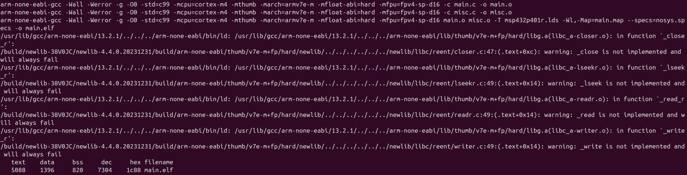
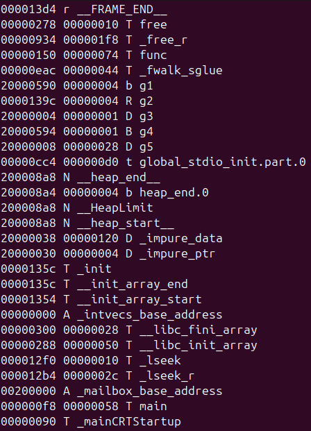
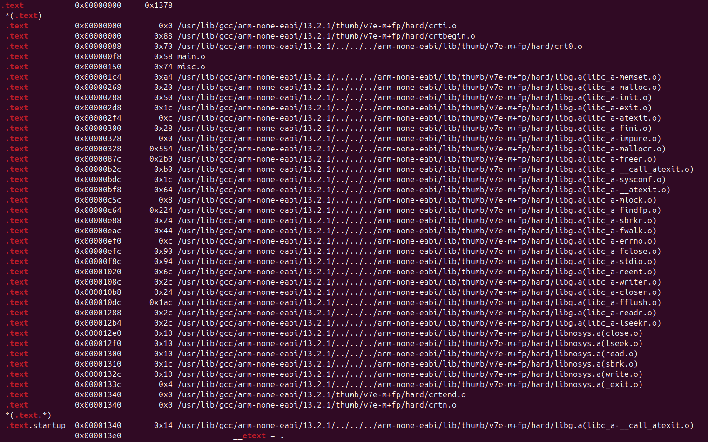
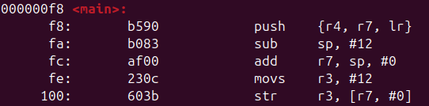

# Memory Segments Control & Analysis: DEVJOURNAL

> This project was developed as part of the **Introduction to Embedded Systems Software & Development Environments** course (Module 3) by the University of Colorado Boulder.
> 
> **Date:** June 6, 2025  
> **Author:** Timofei Alekseenko  

---

## Step 1 — Initial Setup & Makefile Creation

### 1. Given

- **A [folder](https://github.com/afosdick/ese-coursera-course1/tree/master/assessments/m3) containing**:
  - `main.c`
  - `misc.c`
  - `misc.h`
  - `msp432p401r.lds`

- **Requirements & Instructions**:
  1. Analyze how code/data symbols are placed in memory.
  2. Generate a `.map` file.
  3. Use `nm`, `objdump`, etc., to inspect symbol addresses, sections, lifetimes, access.
  4. Ultimately, analyze for each symbol:
     - Top segment (Code/Data/Peripheral/Register/None)
     - Sub-segment (Stack/Heap/BSS/Data/const/rodata/None)
     - Access permissions (R/W/RW/None)
     - Lifetime (Function/Block/Program/Indefinite/None)

### 2. Objective of Step 1

- **Create a working Makefile** that:
  - Compiles `main.c` & `misc.c` for MSP432 (Cortex-M4F).
  - Links with the `.lds` script to produce `main.elf` & `main.map`.
  - Uses `--specs=nosys.specs` to stub out Newlib syscalls.
  - Provides a minimal “all” and “clean” target.
  
> **Update**. As part of this step, **additional targets** were added to the *Makefile*, allowing automatic **generation of the symbol table** (`symbols.txt`) & **disassembly of the ELF file** (`main.out.asm`). These tasks, previously performed manually in the *terminal*, can now be executed with `make symbols` & `make disasm`.

### 3. The Makefile (Updated)

```makefile
# Source files
SOURCES := main.c misc.c

# Compiler & flags
CC      := arm-none-eabi-gcc
CFLAGS  := -Wall -Werror -g -O0 -std=c99 \
           -mcpu=cortex-m4 -mthumb -march=armv7e-m \
           -mfloat-abi=hard -mfpu=fpv4-sp-d16
LDFLAGS := -T msp432p401r.lds -Wl,-Map=main.map --specs=nosys.specs

# Size tool (optional)
SIZE    := arm-none-eabi-size

# Derived targets
OBJECTS := $(SOURCES:.c=.o)
ELF     := main.elf

# Phony targets
.PHONY: all disasm symbols clean

# 'all' builds the ELF and memory map
all: $(ELF)

# Link the final ELF & generate the map
$(ELF): $(OBJECTS)
	$(CC) $(CFLAGS) $(OBJECTS) $(LDFLAGS) -o $@
	@$(SIZE) $@

# Compile each .c into .o
%.o: %.c
	$(CC) $(CFLAGS) -c $< -o $@

# Disassemble the ELF into human-readable assembly
disasm: $(ELF)
	arm-none-eabi-objdump -d $(ELF) > main.out.asm

# Extract symbol table from the ELF
symbols: $(ELF)
	arm-none-eabi-nm --print-size --radix=x $(ELF) > symbols.txt

# 'clean' removes all generated artifacts
clean:
	rm -f $(OBJECTS) $(ELF) main.map main.out.asm symbols.txt
```

### 4. Verifying Makefile Operation

1. **Navigate to project folder:**

   ```bash
   cd ~/.../Module3
   ls
   # Expected: main.c  misc.c  misc.h  msp432p401r.lds  Makefile
   ```

2. **Run `make` (or `make all`):**

   ```bash
   make
   ```

   - Two **compilation** steps:

     ```bash
     arm-none-eabi-gcc [CFLAGS] -c main.c -o main.o
     arm-none-eabi-gcc [CFLAGS] -c misc.c -o misc.o
     ```
   - One **linking** step:

     ```bash
     arm-none-eabi-gcc [CFLAGS] main.o misc.o -T msp432p401r.lds -Wl,-Map=main.map --specs=nosys.specs -o main.elf
     ```
   - **Warnings** about stubbed *syscalls* (`_close`, `_lseek`, `_read`, `_write`) — can be *ignored*:

     ```bash
     warning: _close is not implemented and will always fail
     warning: _lseek is not implemented and will always fail
     warning: _read is not implemented and will always fail
     warning: _write is not implemented and will always fail
     ```
   - `size` **output**:

     ```bash
       text	   data	    bss	    dec	    hex	filename
       5088	   1396	    820	   7304	   1c88	main.elf
     ```

   > 

3. **List generated files:**

   ```bash
   ls
   # Outputs: main.c  main.o  main.elf  main.map  misc.c  misc.o  misc.h  msp432p401r.lds  Makefile
   ```

### 5. Step 1 Results

- **Makefile** in place and working.
- **Compiled objects**: `main.o`, `misc.o`.
- **ELF executable**: `main.elf`.
- **Linker map**: `main.map` (contains section/symbol addresses).
- **Warnings** about stubbed syscalls (expected due to `--specs=nosys.specs`).
- `main.elf` size reported by `size`.

---

## Step 2 — Symbol Extraction & Preliminary Analysis

### 1. Objective of Step 2

- **Generate a complete list of all symbols** in `main.elf` (functions, globals, etc.) using `nm` or `arm-none-eabi-nm`.
- **Inspect `main.map`** to correlate each symbol with its section and address.
- **Prepare initial notes** for where each symbol likely belongs (top segment, sub-segment, access, lifetime).

### 2. Commands & Outputs

1.  **Generate `symbols.txt`**:
    
    ```bash
	# cd ~/.../Module3
	arm-none-eabi-nm --print-size --radix=x main.elf > symbols.txt
    ```
    
    > This produces `~/.../Module3/symbols.txt`, listing each symbol’s address, size, and section code.
    
    > **Update**. Now we can run it via *Makefile*: `make symbols`. This will automatically generate the `symbols.txt` file, listing each symbol’s address, size, and section code.
    
2.  **Open `symbols.txt`**:
	```bash
	less symbols.txt
	```
	
	*and note a few key entries*:
	> 
    
    ```
	000000f8 00000058 T main        → .text (code)
	00000150 00000074 T func        → .text (code)
	20000004 00000001 D g3          → .data (initialized global)
	20000594 00000001 B g4          → .bss (uninitialized global)
	20000590 00000004 b g1          → .bss (compiler-generated)
	0000139c 00000004 R g2          → .rodata (read-only constant)
	```
  
	> These helped identify **Top segment, Subsegment, Access & Lifetime**.

3.  **Inspect `main.map`:**
    
    ```bash
	less main.map
	```
    
	Locate *section addresses*. For the `.text` section:
	```bash
	grep '\.text' main.map
	```

	> 
        
	Similarly, by the `grep` we can find all other sections:
	```bash
	grep '\.data'   main.map
	grep '\.bss'    main.map
	grep '\.rodata' main.map
	```
        
	**Section ranges** (from the `grep` outputs):
	```
	.text   →  [0x00000000 , 0x00001378)
	.rodata →  [0x00001378 , 0x00001378 + 0x5c = 0x000013d4)
	.data   →  [0x20000000 , 0x20000000 + 0x574 = 0x20000574)
	.bss    →  [0x20000574 , 0x20000574 + 0x334 = 0x200008A8)
	```
	
	**Cross-reference**. Find each symbol’s address in `symbols.txt` and see which range it falls into:
	```bash
	grep 'main' symbols.txt
	```
	
	*shown*:

	```
	000000f8 00000058 T main
	```

	**Therefore**, `main` → `.text`.
	And so on *for each searching symbol*.

### 3. Initial Symbol Classification

Below is a **sample table** of a few components. See columns: **Top segment / Sub-segment / Access / Lifetime**.

| Symbol | Address    | Section   | Top segment | Sub-segment  | Access | Lifetime |
| ------ | ---------- | --------- | ----------- | ------------ | ------ | -------- |
| `main` | 0x000000f8 | `.text`   | Code        | Text         | R/X    | Program  |
| `func` | 0x00000150 | `.text`   | Code        | Text         | R/X    | Program  |
| `g3`   | 0x20000004 | `.data`   | Data        | Data         | RW     | Program  |
| `g4`   | 0x20000594 | `.bss`    | Data        | BSS          | RW     | Program  |
| `g2`   | 0x0000139c | `.rodata` | Data/Const  | const/rodata | R      | Program  |
| `g1`   | 0x20000590 | `.bss`    | Data        | BSS          | RW     | Program  |

### 4. Step 2 Results

- **`symbols.txt`** created — full symbol listing available.
- **`main.map`** reviewed — section boundaries and addresses noted.
- **Initial** (a sample) **classification table** drafted for a subset of symbols.

> Symbols successfully *extracted & cross-referenced* against the `main.map` to classify them based on their location and access permissions.

---

## Step 3 — Disassembly & Insights

### 1. Objective of Step 3

- **Disassemble `main.elf`** to examine actual layout of code and data references.

### 2. Commands & Outputs

1. **Generate disassembly**:
   ```bash
   # cd ~/.../Module3
   arm-none-eabi-objdump -d main.elf > main.out.asm
	```

    > This produces `~/.../Module3/main.out.asm`.

    > **Update**. Now we can run it via *Makefile*: `make disasm`. This will automatically generate the `main.out.asm` file, containing the disassembly of `main.elf`.

2. **Inspect function prologue** (for `main`):

   ```bash
   grep -A5 "<main>:" main.out.asm
   ```

   *Get the output*:

   ```
   000000f8 <main>:
      f8:	b590      	push	{r4, r7, lr}
      fa:	b083      	sub	sp, #12
      fc:	af00      	add	r7, sp, #0
      fe:	230c      	movs	r3, #12
     100:	603b      	str	r3, [r7, #0]
   ```

> 

   > See that `main` starts exactly at the address `0xF8`.

### Step 3 Results

- Disassembly was generated, and the entry point of `main` was verified.
- The labels from `symbols.txt` were confirmed to match the actual addresses in `.text`.
- The accuracy of the `nm`/`map` findings was confirmed: the raw assembly shows the function is indeed where expected.
- A simple “safety check” was performed.

---

