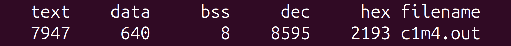

## Memory Manipulation Functions & Cross-Platform Build System

This project implements an expanded build system with memory operations, supporting both **HOST (x86_64)** and **MSP432 (Cortex-M4F)** platforms. It includes statistical calculations, memory manipulation utilities, and data conversion functions.

---

### Key Features

- **Cross-platform build system** (Make/GCC)  
- **Memory operations** with safe handling of overlapping regions  
- **Data conversion** between integers and ASCII strings  
- **Comprehensive test suite** covering all functionality  
- **Configurable verbosity** for debugging

---

### Build Options

| Variable | Values | Description |
| --- | --- | --- |
| PLATFORM | HOST/MSP432 | Target platform |
| VERBOSE | 0/1 | Enable debug printing |
| COURSE1 | 0/1 | Enable final assessment tests |

---

### Testing & Verification

The following commands cover all build, test, and verification steps for both HOST and MSP432 platforms.

#### Build & Run Tests on HOST

```bash
# Build executable with all tests and verbose debug output enabled
make build PLATFORM=HOST COURSE1=1 VERBOSE=1
```

Expected size output (HOST):



```bash
# Run the test suite
./c1m4.out
```

Terminal output showing all tests passing with verbose details:


#### Build for MSP432

```bash
# Build executable for MSP432 platform (requires Arm toolchain)
make build PLATFORM=MSP432 COURSE1=1 VERBOSE=1
```

Expected size output (MSP432):


> **Nota bene**: Tests cannot be run natively because the binary is compiled for the MSP432 Arm Cortex-M4F architecture, which is incompatible with the host CPU architecture. Deploy and debug on the target hardware or simulator as needed.

---

### Other Build Commands

```bash
make compile-all PLATFORM=HOST        # Compile all object files (HOST)
make compile-all PLATFORM=MSP432      # Compile all object files (MSP432)

make build PLATFORM=HOST              # Build and link executable (HOST)
make build PLATFORM=MSP432            # Build and link executable (MSP432)

make clean PLATFORM=HOST              # Clean all artifacts (HOST)
make clean PLATFORM=MSP432            # Clean all artifacts (MSP432)

make check PLATFORM=HOST              # Clean + build + generate asm + disassemble (HOST)
make check PLATFORM=MSP432            # Clean + build + generate asm + disassemble (MSP432)

make main.i PLATFORM=HOST             # Generate preprocessed output from src/main.c (HOST)
make main.i PLATFORM=MSP432           # Generate preprocessed output from src/main.c (MSP432)

make main.asm PLATFORM=HOST           # Generate assembly from src/main.c (HOST)
make main.asm PLATFORM=MSP432         # Generate assembly from src/main.c (MSP432)

make main.o PLATFORM=HOST             # Build single object file src/main.o (HOST)
make main.o PLATFORM=MSP432           # Build single object file src/main.o (MSP432)

make c1m4.out.asm PLATFORM=HOST       # Disassemble final executable (HOST)
make c1m4.out.asm PLATFORM=MSP432     # Disassemble final executable (MSP432)
```

- **PHONY targets**:  
    - `compile-all`: Compile all object files without linking;  
    - `build`: Compile, link, and generate memory map; output binary size;  
    - `clean`: Remove all generated artifacts;  
    - `check`: Clean, build, generate `.asm` from `.c` and `.out`, and disassembly via `objdump`.

- **File-specific targets**:  
    - `%.i`: Preprocessed source file (via `-E`);  
    - `%.asm`: Assembly output from C source (via `-S`);  
    - `%.o`: Object file (via compilation);  
    - `%.out.asm`: Disassembled output binary (via `objdump`).

---

### Toolchain Requirements

| Platform | Tools |
| --- | --- |
| HOST | GCC, GNU Make |
| MSP432 | Arm Embedded Toolchain, GNU Make |

---

Developed for *Introduction to Embedded Systems Software and Development Environments* (Module 4 | Course 1 Final Assessment) by University of Colorado Boulder.
